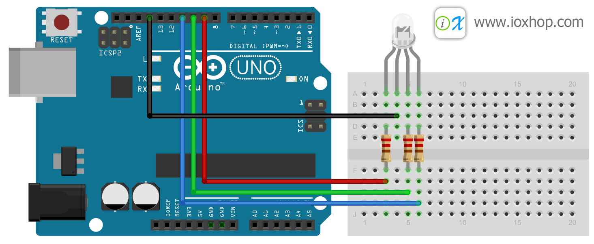

# Arduino กับการใช้งาน RGB LED
ก่อนอื่นมาทำความรู้จักกับหลอด LED RGB กันก่อนครับ หลอด LED RGB ภายในหลอดจะมี LED ทั้งหมด 3 แม่สี คือ สีแดง สีเขียว และสีน้ำเงิน อยู่ภายใน และมีขาต่อใช้งานทั้งหมด 4 ขา ประกอบด้วยขา Common R G และ B ซึ่งขา Common จะเป็นขาที่รวมขา A หรือขา K ของหลอด LED แต่ละสีเข้าด้วยกัน หากเป็น Common A (CA) จะต้องต่อขา Common เข้าขั่วบวก และป้อนลอจิก 0 (LOW) ออกจากไมโคร จึงจะทำสีที่ต้องการติดสว่างขึ้นมา หากเป็น Common K (CC) จะต้องต่อขา Common ลงกราว์ด แล้วปล่อยลอจิก 0 เข้าไปควบคุม ก็จะทำให้แสงสีที่ต้องการติดสว่างขึ้นมาได้

# การผสมสี
การที่จะทำให้หลอด LED RGB เปล่งแสงออกมาเป็นสีอะไร สามารถทำได้โดยการควบคุมความสว่างของแสงแต่ละสี แบบเดียวกับการผสมสีลงบนจานผสมสี หากให้สีของแต่ละสีติดเท่ากันหมด ก็จะทำให้ได้แสงสีขาวออกมา

การปรับความสว่างของหลอด LED ทำได้จากการปรับค่าดิวตี้ไซเคิลของความถี่ PWM โดยหากค่าดิวตี้ไซเคิลมีมาก ก็จะทำให้หลอด LED สว่างมากขึ้น และหากค่าดิวตี้ไซเคิลน้อยลงจนถึง 0 ก็จะทำให้หลอด LED ดับไปเลย

# ต่อวงจรควบคุมดังนี้

